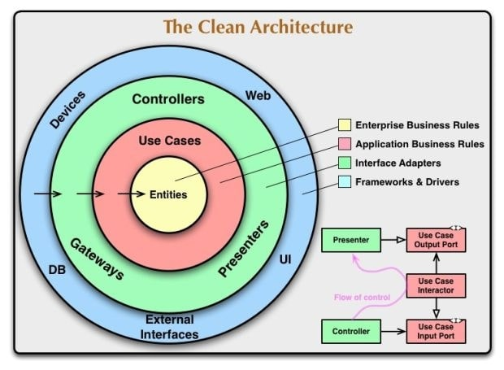
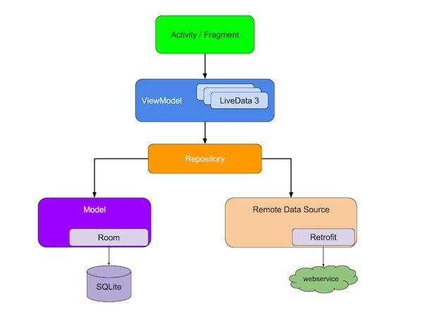
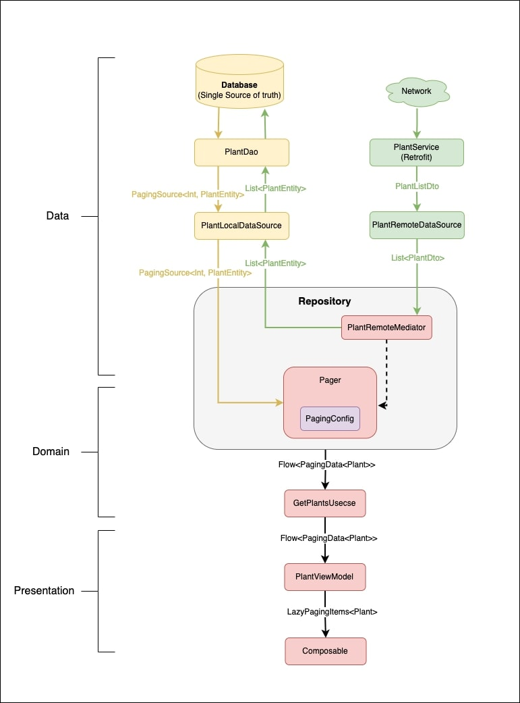

# My Garden App with Clean Architecture & Compose

A gardening app that helps users manage the watering needs of plants. In the app, user can add any number
of plants to their garden from a huge cloud database (backed by Perenual). The app tells the user the last time water is given to
a plant.

## Screenshots
| Mode  | Garden                                              | Plants                                                 | Plant Details                                             |
|-------|-----------------------------------------------------|--------------------------------------------------------|-----------------------------------------------------------|
| Light |  |     |  |
| Dark  |   |  |   |

## Features

1. **Offline-first**: The app can be accessed without an internet connection.
2. **Pagination**: Efficiently loads large amounts of data to improve the user experience.
3. **Search functionality**: Allows users to find specific information within the app quickly.

# Architecture Layers

### 1. Clean Architecture

Clean architecture promotes separation of concerns, making the code loosely coupled. This results in
a more testable and flexible code.



The core principles of the clean approach can be summarized as follows:

1. The application code is separated into layers inside the code base.
2. The layers follow a strict dependency rule, they can only interact with the layers below it.
3. As we move toward the bottom layer — the code becomes generic - The bottom layers dictate
   policies and rules, and the upper layers dictate implementation details such as the database,
   networking manager, and UI.

The 3 modules of architecture are :

* __Presentation__: Layer with the Android Framework, the MVVM pattern and the DI module. Depends on
  the domain to access the use cases and on di, to inject dependencies.
* __Domain__: Layer with the business logic. Contains the use cases, in charge of calling the
  correct repository or data member.
* __Data__: Layer with the responsibility of selecting the proper data source for the domain layer.
  It contains the implementations of the repositories declared in the domain layer. It may, for
  example, check if the data in a database is up to date, and retrieve it from the service if it’s not.

### 2. MVVM
The_ app uses clean architecture with MVVM(Model View View Model) design pattern. MVVM provides
better separation of concern, easier testing, lifecycle awareness, etc.



### 3. Paging 
For pagination, Paging3 library is used which has the following features:

- In-memory caching for your paged data. This helps ensure that your app uses system resources efficiently while working with paged data.
- Built-in request deduplication, which helps ensure that your app uses network bandwidth and system resources efficiently.
- Support for Kotlin coroutines and flows as well as LiveData and RxJava.
- Built-in support for error handling, including refresh and retry capabilities.


Data flow with Paging integration will look like below.



Few points to note
- The local database will act as a single source of truth any remote information will be added/updated on the local database.
- A Remote Mediator is only required if the information has a cloud source.

Google official has comprehensive detail on the Architecture [here](https://developer.android.com/topic/architecture)


## Folder Structure

When using Clean Architecture with Jetpack Compose in an Android app, we can adopt a hybrid approach that incorporates both feature-based and layer-based structuring.
This allows us to leverage the benefits of Clean Architecture and accommodate the UI-centric nature of Jetpack Compose. Feature based approach 
Here's a suggested folder structure:

First first level is *Layer* based and second level is *Feature* based. 

    |-- garden
        |-- MainApplication.kt
        |-- data
        |   |-- api
        |   |-- common
        |   |-- database
        |   |-- di
        |   |-- plant
        |   |   |-- PlantEntity.kt
        |   |   |-- PlantMapper.kt
        |   |   |-- PlantRepositoryImpl.kt
        |   |   |-- PlantService.kt
        |   |   |-- RemoteKeysEntity.kt
        |   |   |-- dao
        |   |   |   |-- PlantDao.kt
        |   |   |-- datasource
        |   |   |   |-- local
        |   |   |   |   |-- PlantLocalDataSource.kt
        |   |   |   |   |-- PlantLocalDataSourceImpl.kt
        |   |   |   |   |-- RemoteKeysLocalDataSource.kt
        |   |   |   |   |-- RemoteKeysLocalDataSourceImpl.kt
        |   |   |   |-- remote
        |   |   |   |   |-- PlantRemoteDataSource.kt
        |   |   |   |   |-- PlantRemoteDataSourceImpl.kt
        |   |   |   |   |-- PlantRemoteMediator.kt
        |   |   |-- dto
        |   |   |   |-- PlantDto.kt
        |   |-- plantandplanting
        |   |-- planting
        |-- domain
        |   |-- common
        |   |   |-- Usecase.kt
        |   |-- fake
        |   |   |-- FakeModels.kt
        |   |-- plant
        |   |   |-- Plant.kt
        |   |   |-- PlantRepository.kt
        |   |   |-- usecase
        |   |   |   |-- GetPlantsUsecase.kt
        |   |-- ..
        |-- presentation
        |   |-- GardenActivity.kt
        |   |-- GardenApp.kt
        |   |-- common
        |   |-- di
        |   |-- garden
        |   |   |-- GardenScreen.kt
        |   |   |-- PlantAndGardenPlantingsViewModel.kt
        |   |-- helper
        |   |-- home
        |   |-- plantdetail
        |   |   |-- PlantDetailScroller.kt
        |   |   |-- PlantDetailView.kt
        |   |   |-- PlantDetailViewModel.kt
        |   |-- theme
        |   |-- view


## Built With 🛠

- [Kotlin](https://kotlinlang.org/) - First class and official programming language for Android
  development.
- [Coroutines](https://kotlinlang.org/docs/reference/coroutines-overview.html) - For asynchronous
  and more..
- [Flow](https://kotlin.github.io/kotlinx.coroutines/kotlinx-coroutines-core/kotlinx.coroutines.flow/-flow/) -
  A cold asynchronous data stream that sequentially emits values and completes normally or with an
  exception.
- [StateFlow](https://developer.android.com/kotlin/flow/stateflow-and-sharedflow) - A live data
  replacement.

- [Android Architecture Components](https://developer.android.com/topic/libraries/architecture) -
  Collection of libraries that help you design robust, testable, and maintainable apps.
    - [Paging3](https://kotlinlang.org/) - Load and display small chunks of data at a time.
    - [LiveData](https://developer.android.com/topic/libraries/architecture/livedata) - Data objects
      that notify views when the underlying database changes.
    - [ViewModel](https://developer.android.com/topic/libraries/architecture/viewmodel) - Stores
      UI-related data that isn't destroyed on UI changes.
    - [SavedStateHandle](https://developer.android.com/reference/androidx/lifecycle/SavedStateHandle) -
      A handle to saved state passed down to androidx.lifecycle.ViewModel.
    - [Navigation Components](https://developer.android.com/guide/navigation/navigation-getting-started) -
      Navigate fragments more easily.
    - [Room](https://developer.android.google.cn/jetpack/androidx/releases/room) - The persistence
      library provides an abstraction layer over SQLite to allow for more robust database access
      while harnessing the full power of SQLite.
    - [WorkManager](https://developer.android.com/topic/libraries/architecture/workmanager) -
      Schedule deferrable, asynchronous tasks

- [Dependency Injection](https://developer.android.com/training/dependency-injection)
    - [Hilt](https://dagger.dev/hilt) - An easier way to incorporate Dagger DI into the Android
      application.
- [Retrofit](https://square.github.io/retrofit/) - A type-safe HTTP client for Android and Java.
- [Mockito](https://github.com/mockito/mockito) - For Mocking and Unit Testing
- [ktlint](https://github.com/pinterest/ktlint/blob/master/README.md#installation) - For code
  styling

## Requirements


### Perenual API key

App uses the [Perenual API](https://perenual.com) to fetch plants. To use the API, you will need to obtain a free developer API key. See the
[Perenual API Documentation](https://perenual.com/docs/api) for instructions.

Once you have the key, add this line to the `gradle.properties` file, either in your user home
directory (usually `~/.gradle/gradle.properties` on Linux and Mac) or in the project's root folder:

```
api_key=<your Perenual access key>
```
### Google Map API key

The app uses the [Google Map API](https://developers.google.com/maps/documentation/android-sdk/get-api-key) to show dummy location of plant for now.

Once you have the key, add this line to the `gradle.properties` file, either in your user home
directory (usually `~/.gradle/gradle.properties` on Linux and Mac) or in the project's root folder:

```
map_api_key=<your Google map api key>
```


## Installation Instruction
For development, the latest version of Android Studio is required. The latest version can be
downloaded from [here](https://developer.android.com/studio/).

App uses [ktlint](https://ktlint.github.io/) to enforce Kotlin coding styles.
Here's how to configure it for use with Android Studio (instructions adapted
from the ktlint [README](https://github.com/shyiko/ktlint/blob/master/README.md)):

- Close Android Studio if it's open

- Download ktlint using these [installation instructions](https://github.com/pinterest/ktlint/blob/master/README.md#installation)

- Apply ktlint settings to Android Studio using these [instructions](https://github.com/pinterest/ktlint/blob/master/README.md#-with-intellij-idea)

- Start Android Studio


## Todo

- [ ] Implement local notifications to remind users about their plant watering schedule.
- [ ] Implement a filter in the Plant list screen.
- [ ] Showing the location of the plant on the Map in the plant detail screen.
- [ ] Deep linking of plants
- [ ] Performance
   - [ ] Baseline Profile
   - [ ] Enable compose compiler matrix
   - [ ] Leak Canary
- [ ] Code Quality
  - [ ] Increase test coverage
  - [ ] Implement Git Hooks
  - [ ] Fix Lint Error
  - [ ] Complete Documentation
 

## Additional Resources
- [Android App Architecture](https://developer.android.com/topic/architecture)
- [Clean Architecture Uncle Bob](https://blog.cleancoder.com/uncle-bob/2012/08/13/the-clean-architecture.html)

## Third Party Content

Select text used for describing the plants (in `plants.json`) are used from Wikipedia via CC BY-SA 3.0 US (license in `ASSETS_LICENSE`).

"[seed](https://thenounproject.com/search/?q=seed&i=1585971)" by [Aisyah](https://thenounproject.com/aisyahalmasyira/) is licensed under [CC BY 3.0](https://creativecommons.org/licenses/by/3.0/us/legalcode)
